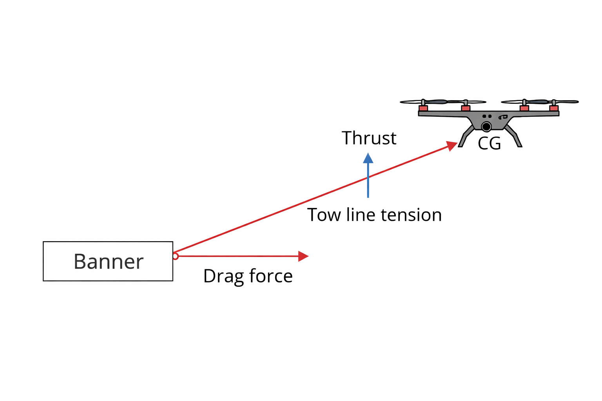

# Conceptual Design and Feasibility Analysis of a Banner Towing UAV (BlackPanther F450 Platform)

> NOTE: This was a conceptual (on-paper) design project and was not physically built or flight-tested. The focus was on feasibility analysis and system-level UAV design.

---

## Project Summary

This project presents the conceptual design and feasibility analysis of a quadcopter UAV capable of towing a lightweight advertising banner at very low forward speeds.

The study evaluates propulsion sizing, aerodynamic drag estimation, endurance performance, and mission safety considerations to determine whether a standard F450-class multirotor platform can operate effectively under high-drag payload conditions.

The work focuses on engineering analysis and system-level design decisions rather than hardware implementation.

---

## System Concept Diagram

The diagram illustrates the primary forces acting on the UAV during banner towing, including thrust, tow-line tension, and aerodynamic drag acting on the trailing banner.

---

## Project Objectives

- Design a UAV capable of towing a banner at very low speeds (≈0.8–1.2 m/s)
- Maintain flight stability under aerodynamic drag and dynamic payload effects
- Enable repeat autonomous missions between predefined waypoints
- Integrate safety considerations suitable for demonstration environments

---

## System Architecture

### Frame
BlackPanther F450 (450 × 450 mm)

### Configuration
Quadcopter UAV

### Flight Controller
ArduPilot-based system

### Navigation
GPS waypoint mission control

### Control Mode
Autonomous mission execution with manual override capability

---

## Component Selection

Component selection was driven by thrust margin, efficiency at low speeds, and stability under increased drag loading.

### Motors
- 2206–2212 class
- KV matched to battery voltage
- Sized to maintain sufficient thrust-to-weight margin under payload conditions

### Propellers
- 7–9 inch propellers
- Selected for static thrust efficiency rather than high-speed performance

### ESC
- 4-in-1 ESC (30–45A)
- Compact integration with adequate current headroom

### Battery
- 4S/6S LiPo (1200–3000 mAh)
- Sized based on endurance analysis and mission requirements

---

## Banner Design and Tow System

- Lightweight ripstop nylon/polyester banner
- Maximum banner area ≤ 0.25 m²
- Spreader rod along top edge to reduce flutter
- Dual-bridle tow configuration
- Tow attachment located ahead of center of gravity for improved stability
- Weak link and swivel assembly for safety

The trailing banner introduces additional aerodynamic drag and dynamic oscillatory loads that influence propulsion sizing and flight control tuning.

---

## Engineering Insights

- Banner drag significantly influences endurance even at low forward speeds.
- Trailing payload behaves similarly to a damped pendulum, introducing oscillatory forces.
- Tow attachment location relative to the center of gravity strongly affects stability.
- Static thrust capability is more critical than forward-flight efficiency for this mission profile.
- Mission planning must incorporate conservative battery reserve margins.

---

## Performance Analysis

### Endurance vs Battery Capacity

An endurance sensitivity study was conducted under low-speed towing conditions.

#### Assumptions

- Average propulsion power: 160 W
- Usable battery fraction: 80%
- Low-speed banner towing flight regime

#### 4S LiPo Endurance

#### 6S LiPo Endurance

#### Observations

- 4S 1500–2200 mAh packs meet the 5-minute mission requirement with reserve.
- 6S configurations increase endurance but introduce additional mass and system complexity.

---

### Drag vs Speed Analysis

Drag force estimated using:

D = 0.5 × ρ × Cd × A × V²

Where:

- ρ = 1.2 kg/m³
- Cd = 1.4
- A = 0.25 m²

| Speed (m/s) | Drag (N) |
|------------|---------|
| 0.5 | 0.05 |
| 1.0 | 0.21 |
| 1.5 | 0.47 |
| 2.0 | 0.84 |
| 2.5 | 1.31 |

Insight:
Drag increases quadratically with velocity, confirming that very low-speed operation is optimal for banner towing missions.

---

## Theoretical Calculations

### Drag Estimation

Estimated drag at 1 m/s:

≈ 0.21 N

Accounting for dynamic oscillatory effects:

≈ 60–90 gf effective load

### Power Budget

Estimated hover power (~1 kg AUW):

140–220 W

Additional power required for banner drag:

15–30 W

These estimates informed propulsion sizing decisions.

---

## Safety and Compliance

- Weak-link tow connection
- Visual Line of Sight (VLOS) operation
- Defined flight corridor
- Battery failsafe logic
- Manual override capability
- Wind operating limit < 3 m/s

---

## Testing Methodology (Conceptual Plan)

- Bench electrical validation
- Hover testing without banner
- Ballast testing
- Tethered banner trials
- Autonomous mission evaluation

---

## Team and My Role

My contributions included:

- Component selection and system configuration
- Avionics setup and ArduPilot parameter planning
- Theoretical performance calculations
- Tow system integration design

---

## Limitations

- No physical prototype or flight testing conducted
- Drag model simplified
- Banner aeroelastic behavior not modeled
- Environmental disturbances not simulated

---

## Conclusion

This conceptual study demonstrates the feasibility of a banner-towing UAV based on an F450-class platform. Analysis indicates that low-speed banner towing is viable when propulsion sizing, damping strategies, and conservative mission planning are properly implemented.

Future work may include higher-fidelity aerodynamic modeling, CFD validation, and experimental flight testing.
